<p align="right">  </p>

# 🧠 Datastasis AI

<div align="center">

**Engineering Intelligent Systems**

From Data to Deployment • Research to Production • Prototype to Scale

[](https://datastasisai.github.io/)
[](mailto:datastasis.ai@gmail.com)

</div>

---

## 🎯 Mission

> ***"Give data meaning that drives business success"***

We bridge the gap between cutting-edge AI/ML research and production-ready systems. Every line of code is designed with **reproducibility**, **scalability**, and **responsible AI** at its core.

---

## 🚀 What We Do

```mermaid
graph LR
    A[Raw Data] --> B[Intelligent Processing]
    B --> C[ML Models]
    C --> D[Production APIs]
    D --> E[Business Impact]
    style A fill:#1a1f2e,stroke:#64ffda
    style E fill:#1a1f2e,stroke:#64ffda
```



### **Core Capabilities**

| Domain | Technologies | Expertise |
|--------|-------------|-----------|
| 🤖 **ML/AI Engineering** | TensorFlow, PyTorch, scikit-learn | Model design, feature engineering, hyperparameter optimization |
| ☁️ **MLOps & Cloud** | Docker, Airflow, MLflow, Terraform | CI/CD pipelines, GCP/Azure/AWS deployment, infrastructure as code |
| 🧬 **LLMOps & Agents** | LangChain, CrewAI, Hugging Face | RAG systems, vector databases, fine-tuning, agentic workflows |
| 📊 **Data Science** | Pandas, NumPy, Plotly | EDA, statistical modeling, interactive dashboards, storytelling |
| 🔧 **Data Engineering** | Kafka, Spark, BigQuery | ETL/ELT pipelines, data lakes, streaming processing |
| 🛡️ **AI Governance** | Evidently, Fairlearn, SHAP | Model monitoring, bias detection, explainability, compliance |

---

## 🛠️ Tech Stack

<div align="center">

### Core Languages & Frameworks


### Deep Learning & AI


### LLMs & NLP


### Vector Databases & RAG


### MLOps & Orchestration


### Containerization & Infrastructure


### Cloud Platforms


### Data Engineering & Streaming


### Databases


### API & Backend


### Monitoring & Observability


### Version Control & CI/CD


### Data Visualization


</div>

---

## 📁 Featured Projects

<table>
<tr>
<td width="50%" valign="top">

### 🔍 Intelligent Document Processing
End-to-end MLOps solution for document classification and extraction using transformer models.

**Stack:** PyTorch • Transformers • Docker • MLflow • GCP • FastAPI

**Impact:** 95%+ accuracy • Automated retraining • Drift monitoring

</td>
<td width="50%" valign="top">

### 🤖 RAG-Powered Knowledge Assistant
Production LLM application with retrieval-augmented generation and conversational memory.

**Stack:** LangChain • CrewAI • Pinecone • OpenAI • Redis

**Impact:** Vector search • Context management • Streaming responses

</td>
</tr>
<tr>
<td width="50%" valign="top">

### 🚨 Real-time Anomaly Detection
Scalable ML system for streaming data with automated alerting and monitoring.

**Stack:** scikit-learn • Kafka • Evidently • Grafana • Terraform • AWS

**Impact:** Sub-second latency • Auto-scaling • Model drift detection

</td>
<td width="50%" valign="top">

### 📊 AI-Powered Competitor Intelligence
Data-driven system analyzing competitors through public data and sentiment analysis.

**Stack:** Python • NLP • Hugging Face • BeautifulSoup • Power BI

**Impact:** Trend detection • Job posting analysis • Automated reporting

</td>
</tr>
<tr>
<td width="50%" valign="top">

### 💼 Predictive Customer Churn
ML model predicting customer attrition with 94% accuracy and explainable predictions.

**Stack:** XGBoost • FastAPI • MLflow • Azure • PostgreSQL

**Impact:** SHAP explanations • Feature importance • A/B testing

</td>
<td width="50%" valign="top">

### 🛒 Intelligent Demand Forecasting
Deep learning model for retail demand and pricing predictions with seasonal patterns.

**Stack:** TensorFlow • Prophet • BigQuery • GCP • Looker Studio

**Impact:** Multi-step forecasting • Seasonal decomposition • Scenario planning

</td>
</tr>
</table>

---

## 🎓 Our Workflow

```
Discovery → Data Ingestion → Exploration → Modeling → Evaluation → MLOps → Deployment → Monitoring
    ↓            ↓                ↓           ↓           ↓          ↓          ↓           ↓
Business       API/DB/          EDA &      Feature     Offline     CI/CD &    Batch/      Drift &
  Goals       Streaming       Profiling     Store      Metrics     Docker    Real-time    Quality
```

1. **Discovery**: Align on KPIs, constraints, data availability
2. **Ingestion**: Validate schemas, quality checks at source
3. **Exploration**: Profile data, detect drift, scan for bias
4. **Modeling**: Feature engineering, classical ML, deep learning, LLMs
5. **Evaluation**: Cross-validation, human-in-the-loop, fairness checks
6. **MLOps**: Version control (data/model/code), automated pipelines
7. **Deployment**: FastAPI/gRPC services, canary releases, scalable infra
8. **Monitoring**: Telemetry, drift detection, feedback loops

---

## 🌟 Why Datastasis?

<table>
<tr>
<td width="33%" align="center">

### 🎯 **Production-First**
Built for scale, not demos. Every system is designed for real-world deployment with monitoring and maintenance in mind.

</td>
<td width="33%" align="center">

### 🔬 **Research-Driven**
Stay current with latest papers and techniques. We experiment, validate, and adopt what actually works.

</td>
<td width="33%" align="center">

### 🤝 **Transparent & Ethical**
Reproducible experiments, documented decisions, bias detection, and explainable AI throughout the pipeline.

</td>
</tr>
</table>

---

## 📚 Latest Insights

- 🚀 [Building Production-Ready ML Pipelines](https://datastasis.ai/#blog) - MLOps best practices
- 🧠 [RAG Systems: Beyond Basic Retrieval](https://datastasis.ai/#blog) - Advanced LLM techniques  
- 📊 [Scaling Feature Stores for ML](https://datastasis.ai/#blog) - Data engineering patterns

---

## 🤝 Get Involved

We're passionate about:
- **Open Source**: Contributing to and maintaining ML/AI tools
- **Knowledge Sharing**: Writing technical deep-dives and tutorials
- **Community Building**: Helping others solve complex problems

### Ways to Connect

- 🌐 **Website**: [datastasis.ai](https://datastasisai.github.io/)
- 📧 **Email**: [datastasis.ai@gmail.com](mailto:datastasis.ai@gmail.com)
- 💼 **Collaborations**: Open to consulting, research partnerships, and technical advisory

---

<div align="center">

**Engineering Intelligent Systems**

`Machine Learning` • `Deep Learning` • `MLOps` • `LLMOps` • `Data Engineering` • `Cloud Computing`

</div>
